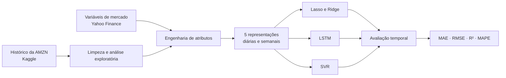

# Previsão de preços das ações da Amazon

[](https://www.python.org/)
[](https://jupyter.org/)
[](https://scikit-learn.org/)
[](https://www.tensorflow.org/)

Projeto de séries temporais que compara **Lasso**, **Ridge**, **LSTM** e **Support Vector Regression (SVR)** na previsão do preço de fechamento das ações da Amazon (`AMZN`). A análise reúne histórico de preços, indicadores técnicos e variáveis externas de mercado em versões diárias e semanais dos dados.

> Este projeto tem finalidade educacional e experimental. Os resultados não constituem recomendação de investimento.

## Visão geral

O notebook cobre o fluxo completo de um experimento de machine learning:



Principais entregas:

- análise exploratória do histórico de preços e volume;
- médias móveis, retornos, volatilidade, RSI e sinais de tendência;
- integração com DXY, VIX, NASDAQ, juros dos EUA e ações de grandes empresas de tecnologia;
- comparação de cinco representações dos dados;
- divisão treino/teste sem embaralhamento para preservar a ordem temporal;
- previsões de curto prazo e experimentos com horizonte de 90 períodos;
- comparação histórica com preços obtidos no Yahoo Finance.

## Dados

A base principal contém **6.987 observações diárias**, de **15/05/1997 a 21/02/2025**, com preços OHLC, volume, dividendos e desdobramentos. Ela é baixada do dataset [Amazon Stocks 2025, no Kaggle](https://www.kaggle.com/datasets/meharshanali/amazon-stocks-2025). As variáveis externas são coletadas durante a execução com o `yfinance`.

O pipeline gera cinco conjuntos:

| Dataset | Granularidade | Conteúdo |
|---|---:|---|
| `df_original` | diária | variáveis originais da AMZN |
| `df_semanal` | semanal | agregação da base original e médias móveis |
| `df_geral` | diária | base original, indicadores técnicos e variáveis de mercado |
| `df_geral_semanal` | semanal | agregação da base enriquecida |
| `df_top10_corr` | diária | `Close` e as dez variáveis de maior correlação absoluta |

Os CSVs derivados são criados localmente em `datasets/` e não precisam ser versionados.

## Resultados registrados

A tabela resume os melhores resultados preservados na execução do notebook. Como os modelos usam janelas e divisões de teste diferentes, os números devem ser lidos dentro do protocolo de cada modelo, e não como um ranking perfeitamente homogêneo.

| Modelo | Avaliação | Melhor dataset | MAE | RMSE | R² |
|---|---|---|---:|---:|---:|
| SVR | teste temporal, um passo | `df_original` | 1,6528 | 2,4949 | 0,9977 |
| Lasso | horizonte `t+1` | `df_top10_corr` | 2,3859 | 3,2513 | 0,9921 |
| Ridge | horizonte `t+1` | `df_top10_corr` | 2,4167 | 3,2773 | 0,9920 |
| LSTM | teste temporal, um passo | `df_top10_corr` | 4,7935 | 6,0378 | 0,9078 |
| Ridge | horizonte `t+90` | `df_original` | 20,7668 | 26,1239 | 0,4801 |
| Lasso | horizonte `t+90` | `df_original` | 20,7901 | 26,1651 | 0,4784 |

O desempenho cai de forma relevante no horizonte mais longo, comportamento esperado em séries financeiras. A [documentação metodológica](docs/model-card.md) detalha como interpretar essas métricas e quais limitações devem ser consideradas.

## Como executar

Recomenda-se **Python 3.11**, especialmente por compatibilidade com TensorFlow.

```bash
python -m venv .venv
```

No Windows PowerShell:

```powershell
.venv\Scripts\Activate.ps1
python -m pip install --upgrade pip
python -m pip install -r requirements.txt
jupyter lab amazon_stock_price_forecasting.ipynb
```

No Linux ou macOS:

```bash
source .venv/bin/activate
python -m pip install --upgrade pip
python -m pip install -r requirements.txt
jupyter lab amazon_stock_price_forecasting.ipynb
```

Execute as células em ordem. A primeira execução requer internet para baixar a base do Kaggle e as séries externas do Yahoo Finance. O treinamento das LSTMs é a etapa mais demorada.

## Estrutura do repositório

```text
.
├── amazon_stock_price_forecasting.ipynb
├── docs/
│   └── model-card.md
├── .gitignore
├── README.md
└── requirements.txt
```

## Tecnologias

- Python, Pandas e NumPy para tratamento dos dados;
- Matplotlib para visualização;
- scikit-learn para pré-processamento, métricas, Lasso, Ridge e SVR;
- TensorFlow/Keras para a rede LSTM;
- KaggleHub e yfinance para aquisição dos dados.


Preços de ativos são influenciados por notícias, liquidez, mudanças macroeconômicas e eventos que não aparecem no histórico. O bom ajuste em um período passado não garante desempenho futuro. Veja as [limitações e próximos passos](docs/model-card.md#limitações-e-próximos-passos).
